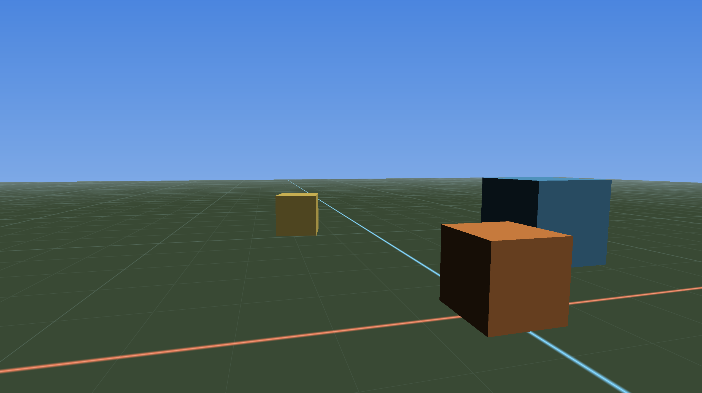

## Minimal SDL2 + OpenGL 4.1 (macOS) C++20 engine scaffold

This repo is a **small, cleanly-layered** engine prototype:

- **Window/input**: SDL2
- **Rendering**: OpenGL **4.1 core profile** (macOS max), loaded via **glad**
- **Math**: GLM
- **Demo**: rotating cube + WASD/mouse free-fly camera + simple directional light

### World Demo Screenshot



### Homebrew deps (Apple Silicon)

```bash
brew install cmake sdl2
```

> GLM is fetched via CMake `FetchContent`.

### Build (arm64)

```bash
cmake -S . -B build -DCMAKE_BUILD_TYPE=Release
cmake --build build -j
./build/app/DemoApp
```

### glad (OpenGL loader)

We vendor glad into `third_party/glad/` and keep a small script + notes in `scripts/`.
See `scripts/generate_glad.md`.

